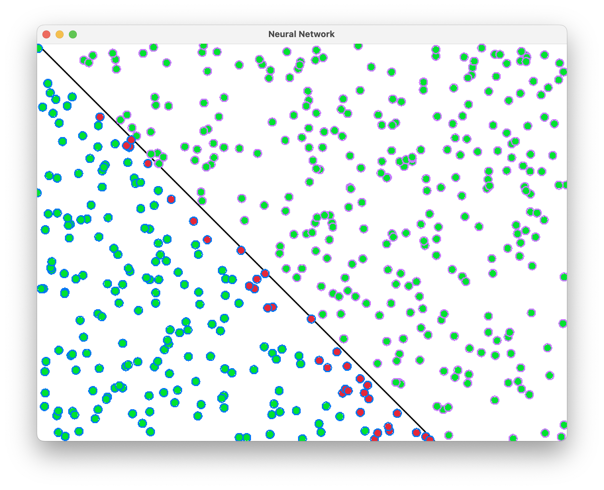

# Neural Network Study

An implementation of a toy neural network from scratch. The idea is to learn about the workings of neural networks and the underlying math, but also to produce something useful.

This project follows a series on neural networks on [The Coding Train](https://youtu.be/ntKn5TPHHAk?si=0DsBd9O9Rp-bqC-H).

## What does it do?

### Stage 1: Perceptron

The first step is creating a perceptron, a single "neuron" that can be used to solve linearly separable problems. An example is classifying points on a plane to determine if they're above or below a line:

<figure>
  
  <figcaption>The perceptron identifies if points are above or below the line</figcaption>
</figure>

## About This Project

