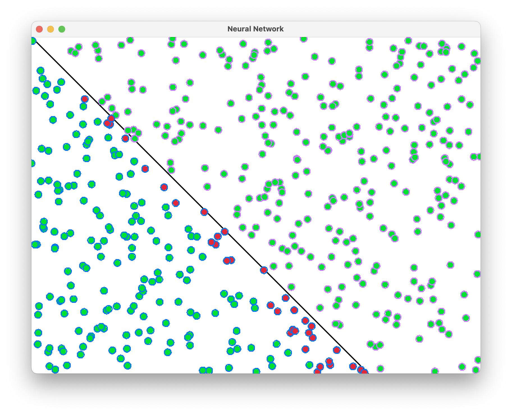
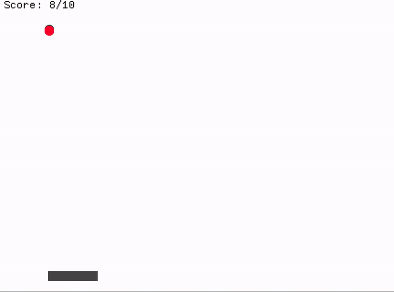

# Neural Network Study

An implementation of a toy [neural network](https://en.wikipedia.org/wiki/Neural_network_(machine_learning)) from scratch. The idea is to learn about the workings of neural networks and the underlying math, but also to produce something useful and, most of all, fun.

This project follows a series on neural networks on [The Coding Train](https://youtu.be/ntKn5TPHHAk?si=0DsBd9O9Rp-bqC-H).

## What does it do?

### Stage 1: Perceptron

The first step is creating a perceptron, a single "neuron" that can be used to solve linearly separable problems. An example is classifying points on a plane to determine if they're above or below a line:

<figure>
  
  <figcaption>The perceptron identifies if points are above or below the line</figcaption>
</figure>

### Stage 2: Multilayer Perceptron - The Neural Network

Once the principle of the perceptron is understood, the next major step in developing a neural network is to create a *multilayer perceptron*, that is, a small network with inputs, a hidden layer, and outputs.

This evolution of the concept can solve a variety of problems. A classic example is a game of moving a basket to catch falling apples -- and in this enhanced version, avoid the sour lemons!



## Demos

### Decision Boundary Playground

A small binary generates a self-contained HTML playground that trains the network on a few 2D classification tasks and visualizes the learned decision boundary.

Run it with:

```bash
cargo run --bin decision_boundary_playground
```

Then open `target/decision-boundary-playground.html` in a browser.

### Flappy Evolution Playground

A binary trains a population of neural networks to play a Flappy Bird-like game with genetic evolution, then generates a standalone replay/report HTML file and saves the best model.

Run it with:

```bash
cargo run --bin flappy_evolution_playground
```

Artifacts:

- `target/flappy-evolution-playground.html` (interactive generation replay + metrics)
- `target/flappy-champion.json` (best model checkpoint)

To warm-start a run from an existing model:

```bash
cargo run --bin flappy_evolution_playground -- --load-model target/flappy-champion.json
```

## About This Project


